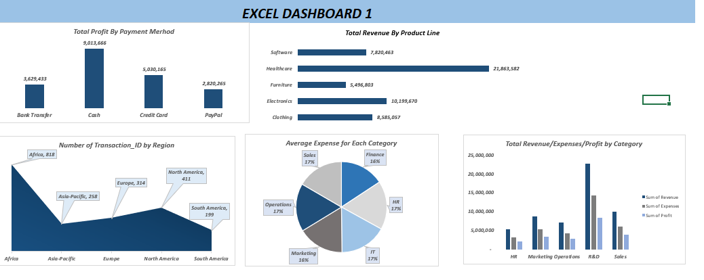

**Business-Performance-Analytics-Dashboard**

An Excel dashboard analyzing business performance data, covering revenue, expenses, and profit across regions, departments, product lines, and payment methods.

**Project Overview:**
This project analyzes transaction-level business data to uncover performance trends across different dimensions of the business. The dashboard breaks down profit by payment method, revenue by product line, transaction volume by region, average expenses by department, and a combined view of revenue, expenses, and profit by category. The goal is to identify which areas of the business are performing well and where costs are being driven.

**Tools Used:**
The raw transaction data was first cleaned in Excel to prepare it for analysis. Pivot tables were then built on top of the cleaned data to summarize revenue, expenses, profit, and transaction counts across various dimensions. These pivot tables were used to create the charts that make up the final Excel dashboard.

**Key Insights:**
Cash was the leading payment method by total profit, generating 9,013,666, followed by Credit Card at 5,030,165, Bank Transfer at 3,629,433, and PayPal at 2,820,265. By product line, Healthcare generated the highest revenue at 21,863,582, followed by Electronics at 10,199,670, Clothing at 8,585,057, Software at 7,820,463, and Furniture at 5,496,803. Africa recorded the highest number of transactions at 818, followed by North America at 411, Europe at 314, Asia-Pacific at 258, and South America at 199. Average expenses were fairly evenly spread across departments, each accounting for roughly 16 to 17 percent of the total. Looking at revenue, expenses, and profit by category, R&D was the strongest performer with the highest revenue and profit, while HR had the smallest overall numbers.

**Dashboard Preview:**

**Files in this Repo:**
This repository includes the raw dataset, the pivot tables used for analysis, and the final Excel dashboard file.

**How to Use:**
Clone or download this repository, then open the Excel file to explore the raw data, pivot tables, and dashboard.
